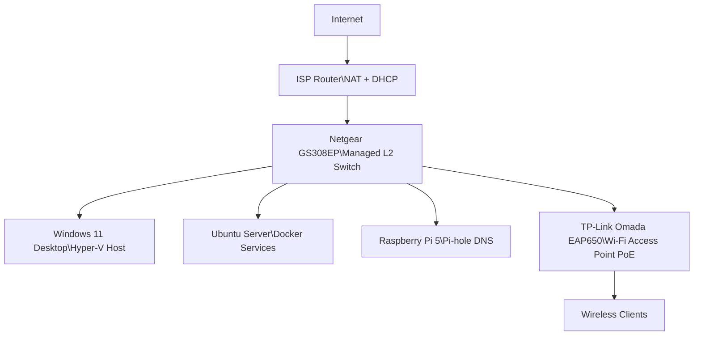

# Home Lab Overview

A security-conscious home lab built to practice entry-level IT skills (networking, virtualization, Linux/Windows administration) and document work in a portfolio-friendly way.

This lab supports:
- Virtualization (Hyper-V)
- Linux and Windows administration
- Networking fundamentals (DNS, DHCP)
- Entry-level infrastructure design and documentation

---

## Start Here (60 seconds)

This repository is the architecture and navigation hub for my home lab.

### Related projects
- IT Support Labs: https://github.com/dallasm92/it-support-labs
- PC Build + Validation: https://github.com/dallasm92/pc-build-main-pc

### One-line summary
Windows 11 Hyper-V host + always-on Ubuntu Server (Docker/services) + Raspberry Pi 5 (Pi-hole DNS) + managed switch + dedicated access point + ISP router (gateway).

---

## Purpose

This repository provides a high-level overview of my personal home lab environment.

It mirrors real-world IT / small-business infrastructure and helps me build hands-on experience in:
- Networking fundamentals
- Virtualization
- Linux and Windows Server administration
- DNS and basic security concepts
- Professional documentation and troubleshooting workflows

This repo acts as the architecture reference point for all other lab projects.

---

## 🧠 Architecture Summary

- Dedicated Windows 11 desktop for virtualization (Hyper-V)
- Separate always-on Ubuntu Server for services
- Raspberry Pi dedicated to DNS filtering (Pi-hole)
- Managed switch for wired connectivity
- Dedicated wireless access point (Omada)
- ISP router acting only as gateway (NAT/DHCP)
- Mixed wired and wireless client environment

### Design focus
- Separation of concerns
- Minimal complexity while remaining realistic
- Repeatable IT workflows
- Security-conscious public documentation

---

## Core Devices & Roles (Sanitized)

| Device | Role |
|---|---|
| Windows 11 Desktop | Hyper-V host, primary workstation |
| Ubuntu Server | Docker host, always-on services |
| Raspberry Pi 5 | Centralized DNS filtering (Pi-hole) |
| Netgear GS308EP | Managed Layer-2 switch (PoE for AP) |
| TP-Link Omada EAP650 | Dedicated wireless access point |
| ISP Router | NAT, DHCP (gateway to ISP) |

---

## 🌐 Network Overview

- Wired devices connect through the managed switch
- Wireless devices connect through the dedicated Omada access point
- The ISP router provides routing and DHCP only
- All clients use centralized DNS filtering

### DNS Flow (Simplified)
Client → Pi-hole (Raspberry Pi) → Upstream DNS (ISP / Public) → Internet

---

## Physical Topology (Simplified)

---

## 📶 Wireless Infrastructure (Omada)

A dedicated access point (**TP-Link Omada EAP650**) provides wireless coverage, separating Wi-Fi responsibilities from routing and gateway functions.

This design more closely reflects real-world small-business and enterprise environments by decoupling:
- Routing
- Switching
- Wireless access

### Planned / In Progress
- Centralized AP management (Omada Controller)
- Guest Wi-Fi segmentation (future VLAN work)
- Coverage and roaming optimization

---

## 📡 Wireless Clients (Examples)

- Amazon Echo Dot
- Apple TV
- Xumo Box (Fire TV)
- iPhones (2)
- HP Victus Laptop
- MacBook (Linux Mint)
- Kindle
- iPad
- Epson XP-4200 Printer

---

## 📂 Related Repositories (Learning Progression)

| Stage | Repository | Focus |
|---:|---|---|
| 1 | IT Support Labs | Ticket-style troubleshooting |
| 2 | PC Build – Main PC | Hardware research, build, and validation |
| 3 | Hyper-V Virtualization Lab (planned) | Multi-OS + Windows Server labs |
| 4 | Linux Server Services (planned) | Ubuntu Server + Docker |
| 5 | DNS & Pi-hole Lab (planned) | DNS filtering + testing |

---

## 🚀 Future Improvements

- Convert printer to full network printing
- VLAN design and documentation
- Dedicated firewall appliance
- Monitoring and uptime tracking
- Expanded service documentation

---

## 🔒 Sanitization & Security

This public repository intentionally omits:
- Exact IP addresses
- Internal hostnames
- API keys or credentials
- Internal configuration files

Documentation focuses on architecture, workflows, and troubleshooting methodology, not sensitive implementation details.

---

## 📌 Why This Lab Exists

This lab exists to build and demonstrate practical, real-world IT skills through hands-on experimentation, troubleshooting, and documentation — while maintaining a clean, professional, and security-conscious public portfolio.

**Last updated:** 2026-01-26
